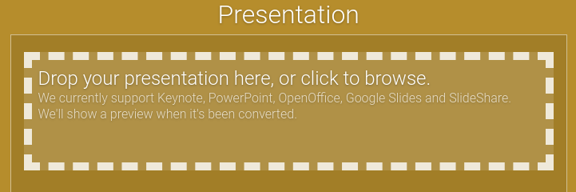
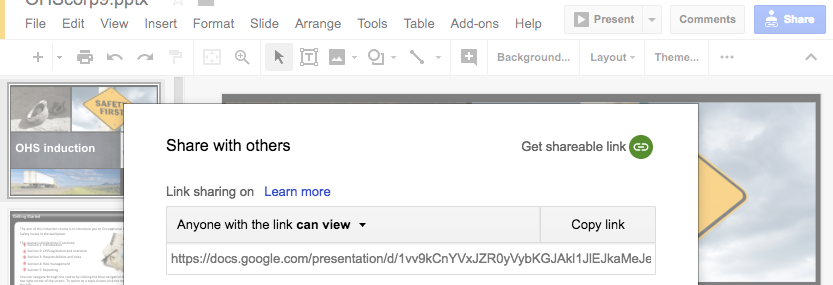
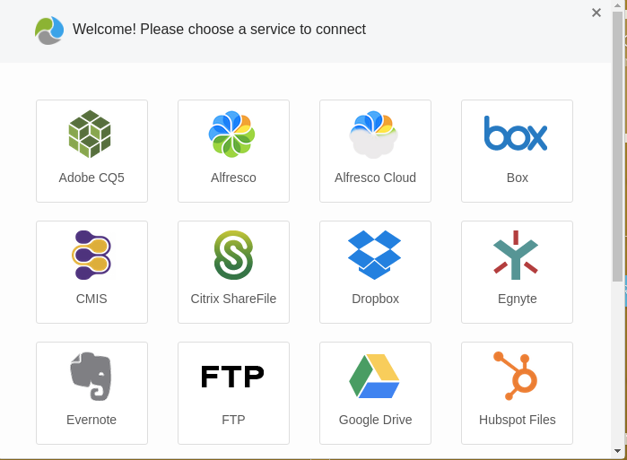
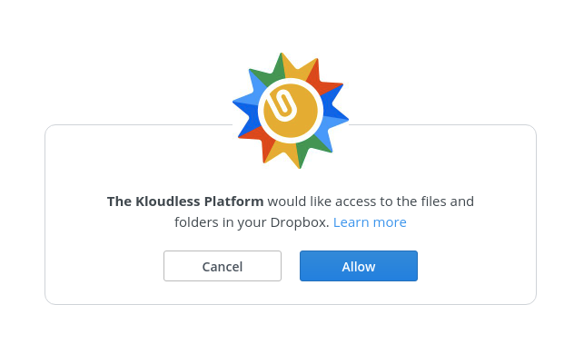
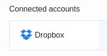

### Uploading
The Presentation Ninja requires a presentation of some sort to begin with. We currently support PowerPoint, KeyNote, OpenOffice. We do not currently support conversion of interactions, embedded media or page transitions - just the basic slides.

Drag and Drop a presentation file from your computer onto the browser and drop it where it says "Drop your presentation here". The area will light up once you are dragging over.

### Linking

You can also link to Google Slides or Slideshare instead of uploading. Paste an URL into the box at the bottom of the first section and press Load to try to load it.

#### Privacy Notes for linked presentations

* **SlideShare** has some privacy options that prevent some slides from being embedded. You may receive a warning about this when you try to embed some presentations. SlideShare presentation slides are downloaded on demand when the package is viewed and do not directly embed within the package due to setting in the SlideShare platform.
* **Google Slides** presentations need to be explicitly shared before they can be embedded. To do this, use the Share settings in Google Slides then click _Get sharable link_.

#### Uploading from the cloud

The Presentation Ninja also supports uploading files from a range of cloud storage providers, start by clicking Choose... in the Upload from cloud section.

You will then see a list of cloud storage providers, choose the one you want to upload from.

You will then be asked to allow the Kloudless Platform to access your files and folders, e.g for dropbox

Click allow and you should then see your account in the list of connected accounts, you can add as many accounts/providers as you want

From here you can select your account, browse to the file you wish to upload, and press select to upload.