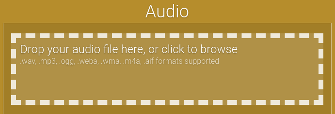
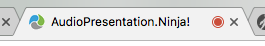
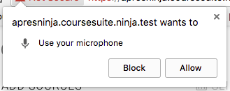
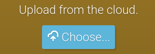
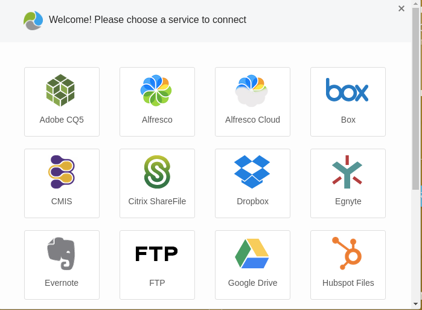
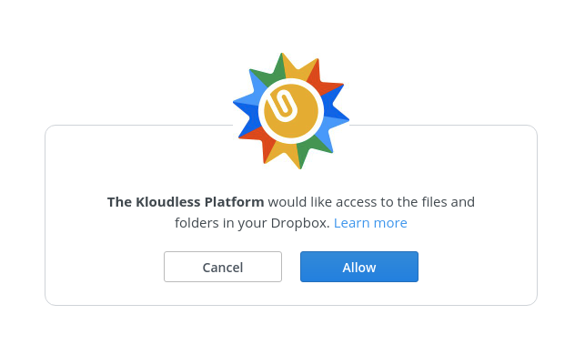
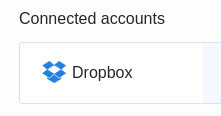

### Uploading
You need to upload an audio file to syncronise the slides to. You do this in the same way as a presentation - select an appropriate file from your desktop and drag and drop it onto the browser - an area with highlight showing you where to drop the file.

You can currently select from these audio formats / extensions:

    .wav, mp3, .ogg, .weba, .wma, .m4a and .aif
    
!!!! **.ogg** is the preferred format for HTML5 (web) audio.

### Recording
Most modern browsers let you record from an attached microphone, once given explit permission to allow it. You only have to grant permission to the microphone once - your browser should remember the setting for subsequent visits to the site. The browser tab often changes to indicate the page is capable of recording audio or video.

! It's best to upload your presentation first. You'll be able to navigate the presentation as you record audio - the system will remember the markers in the audio when your slides change. Use the **left** and **right** arrow keys to preview slides.

Pressing the Record button will check your browsers capabilities to record and may prompt you to allow access to the microphone. Once permissions have been granted the first time, you'll only have to press Record to being recording from your audio source (microphone).

If you allow access, an oscilliscope display will appear on the bottom right of the Audio box indicating the microphone is available.

Tab the Record button to start, and the Stop button when you are finished.
After recording, the audio will be converted to HTML5 formats for you. 

#### Uploading from the cloud

The Presentation Ninja also supports uploading files from a range of cloud storage providers, start by clicking Choose... in the Upload from cloud section.

You will then see a list of cloud storage providers, choose the one you want to upload from.

You will then be asked to allow the Kloudless Platform to access your files and folders, e.g for dropbox

Click allow and you should then see your account in the list of connected accounts, you can add as many accounts/providers as you want

From here you can select your account, browse to the file you wish to upload, and press select to upload.