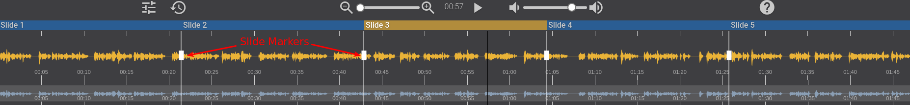
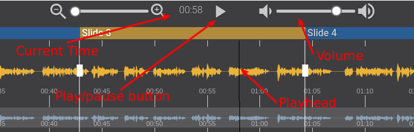
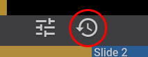

The slide markers page contains a preview of your presentation, as well as a control panel with a waveform representation of your audio file. The control panel allows you to set your slide markers, playback your audio, and navigate the waveform.

!!!! The smaller waveform at the bottom of the control panel is the overview. When you are zoomed in, the visible portion of the wavefrom will be highlighted in the overview. You can click or drag this waveform to navigate, the same as the main waveform.

Slide Markers are the points in the audio track that indicate when a slide should be shown. If you recorded audio from your microphone and the right arrow key to naviate slides as you talked, the slide markers should reflect that. If you uploaded an audio file from your computer, the slide markers will be evenly distribute across the number of slides in your presentation.

These slide markers are displayed on top of the waveform of your audio. You can move them by clicking and dragging their handles. You can also move the waveform, when it is zoomed in, by clicking and dragging it.

### Zoom

Zooming in on the waveform can be very useful if you have a particularly long audio file, or lots of slides, and you want to be extra accurate.
Use the zoom slider to zoom in and out of the waveform.

### Playback

To playback your audio, either press spacebar or click the play/pause button.

The currently active slide will be displayed in the preview area, and its title highlighted in the control panel.

!!!! The volume slider will only affect the volume while you are editing, it will not affect the output package.

### Manual Cue Mode

If you wish to manually enter your cue points you can use manual cue mode. 

When in manual cue mode, you can press the right arrow key to set the next marker. This is useful if you want to listen to your audio and set your markers at the same time.

! Caution: When entering manual cue mode, all cues will be removed!

### Control Panel Reset

The control panel reset button allows you to reload the waveform and reset all cue points to their default even distribution.

### Slide Titles

You can rename your slides by double clicking their titles in the control panel.

Press enter to save, or escape to cancel.

### Help

If at any stage you want to know the function of a part of the control panel, click the help button and a series of tooltips will appear explaining each section of the panel. Click the button again to hide these tooltips.
