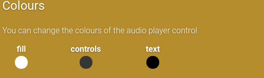
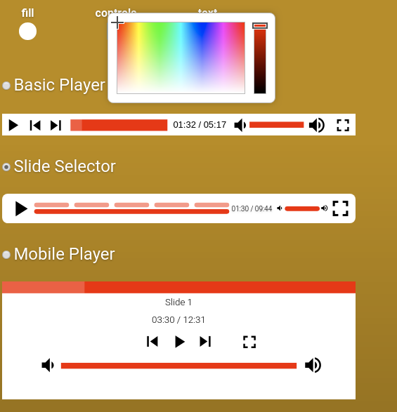
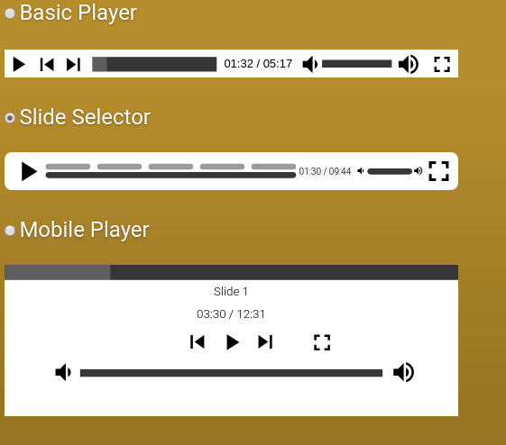
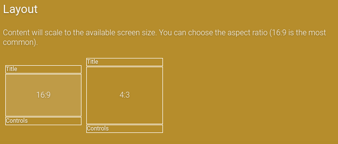
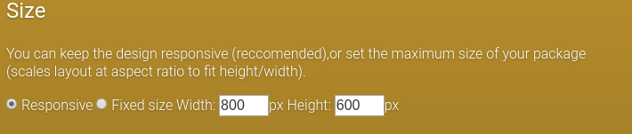
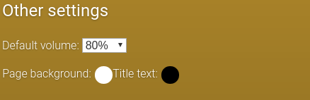

The Design tab lets you specify a few options which control how the final package will be layed out.

### Colours

Here you can alter the colours of the player.

Click on a colour to bring up a colour picker. The colour you choose will be reflected in the player previews below.

### Player type

The player controls how a user interacts with the package.
The basic player simply allows a user to play the pack, and to navigate to the next/previous slide.
The slide selector player uses sections to indicator the length of each slide, and the user can click these sections to navigate directly to that slide. These sections will also display the slide title on hover.
The mobile player is larger and more suited to mobile and other touch devices.

### Aspect ratio

The initial choice for this is picked based on the source material. Many presentations now default to 16:9 aspect ratio (width compared to height) as most monitors are also in the 16:9 or 16:10 ratio. Older presentations used 4:3 ratio and are best visualised as non-widescreen monitors or TV's. The presentation and player will be scaled to fit this ratio then centered in the available space.

### Size

Where possible you should choose your presentation to be Responsive. This means it will stretch out to be as wide or as high as the available space in the LMS or content player. You can also supply a fixed width and height if you desire.

### Other Settings

Here you can set the default starting volume for your package, as well as a page background colour, and colour for the title.
