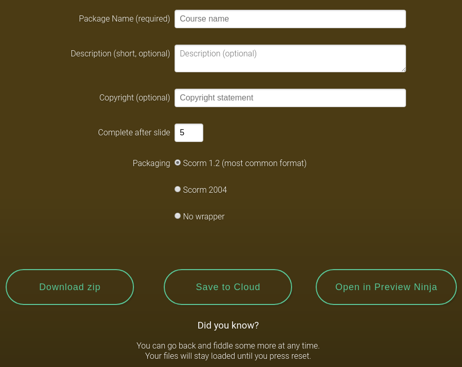

The Download Package screen requires you to at least name your presentation package before you can download it. Other text fields are optional and are recorded in the packages various metadata fields.

**Complete after slide** allows you to set the number of slides a learner has to watch before getting a Scorm completion.

The **packaging** option lets you specify which type of content packaging is included with the published package. For most LMS's this will be Scorm 1.2. The _no wrapper_ setting will still create all the required files to run the presentation but include no extra IMS-related files.

You can download the package as a zip, save the file to a [cloud-based](usage/download-settings#saving-to-cloud) storage device, open in the [Preview Ninja](https://preview.coursesuite.ninja/), or if you are launching the app through our API you may have specified an endpoint for publishing packages and a fourth button "Publish to LMS" will be present. Clicking any of these buttons will prepare the package zip and then prompt you either to download or open the file.

After you download the file, the app will still retain all the content up until you press the Reset button.

#### Saving to cloud

When saving to the cloud you are first asked to connect to a service. We use a platform provider called Kloudless and do not have the ability to read files in any of these services directly. You need to connect to the service you want to save the file to (for instance Dropbox) then choose the location in which you want to save the file. The system will then save the file to that location.

